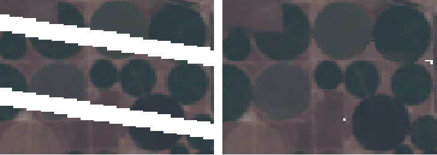

# gapfill-landsat

[](https://pypi.org/project/gapfill-landsat/)
[](https://github.com/pblankenau2/gapfill-landsat/actions/workflows/ci.yml)

Tools for filling missing data in satellite images caused by sensor malfunctions or masked out clouds.
Currently, this package only implements the nearest similar pixel interpolator (NSPI) algorithm
that was specifically designed to fill the Landsat 7 SLC off gap. It can also be used to fill
small areas where clouds have been masked as nodata.



* Free software: MIT license

## References

*   Chen, J., et al. (2011). "A simple and effective method for filling gaps in Landsat ETM+ SLC-off images." Remote Sensing of Environment, 115(4), 1053-1064. https://doi.org/10.1016/j.rse.2010.12.010

## Installation

### Stable release

To install `gapfill-landsat`, run this command in your terminal:

```console
$ uv pip install gapfill-landsat
```

This is the preferred method to install `gapfill-landsat`, as it will always install the most recent stable release.

### From sources

The sources for `gapfill-landsat` can be downloaded from the [Github repo](https://github.com/pblankenau2/gapfill-landsat).

You can either clone the public repository:

```console
$ git clone git://github.com/pblankenau2/gapfill-landsat
```

Or download the `tarball`:

```console
$ curl -OJL https://github.com/pblankenau2/gapfill-landsat/tarball/master
```

Once you have a copy of the source, you can install it with:

```console
$ uv pip install .
```

## Usage

To use `gapfill-landsat` in a project with `rasterio`:

```python
import numpy as np
import rasterio
from gapfill_landsat import nspi

# Open the target Landsat 7 image (with gaps)
with rasterio.open("tests/data/l7.tif") as src7:
    target_image = src7.read()
    profile = src7.profile
    
# Open the source Landsat 8 image (to fill gaps)
with rasterio.open("tests/data/l8.tif") as src8:
    input_image = src8.read()

# Fill the gaps using the NSPI algorithm
filled_image = nspi(target_image, input_image)

# Save the result
with rasterio.open("filled_image.tif", "w", **profile) as dst:
    dst.write(filled_image)
```

The `nspi` function accepts several optional parameters to fine-tune the filling process, such as `similarity_threshold`, `window_sizes`, and `prediction_method`. See the source code for detailed documentation.

## Contributing

Contributions are welcome, and they are greatly appreciated! Every little bit helps, and credit will always be given.

**Please note:** While I am open to contributions, I cannot promise a timely review of pull requests. It is possible that some PRs may not be reviewed at all.

You can contribute in many ways:

- Report bugs at [https://github.com/pblankenau2/gapfill-landsat/issues](https://github.com/pblankenau2/gapfill-landsat/issues).
- Submit feedback and feature requests at [https://github.com/pblankenau2/gapfill-landsat/issues](https://github.com/pblankenau2/gapfill-landsat/issues).
- Write tests, fix bugs, or implement new features.

### Local Development

To set up `gapfill-landsat` for local development:

1.  Fork the `gapfill-landsat` repo on GitHub.
2.  Clone your fork locally:

    ```console
    $ git clone git@github.com:your_name_here/gapfill-landsat.git
    ```

3.  Install your local copy into a virtualenv. Assuming you have `uv` installed:

    ```console
    $ cd gapfill-landsat/
    $ uv venv
    $ uv pip install -e .[dev]
    ```

4.  Create a branch for local development:

    ```console
    $ git checkout -b name-of-your-bugfix-or-feature
    ```

    Now you can make your changes locally.

5.  When you're done making changes, check that your changes pass the tests, including testing other Python versions with `tox`:

    ```console
    $ tox
    ```

6.  Commit your changes and push your branch to GitHub:

    ```console
    $ git add .
    $ git commit -m "Your detailed description of your changes."
    $ git push origin name-of-your-bugfix-or-feature
    ```

7.  Submit a pull request through the GitHub website.
